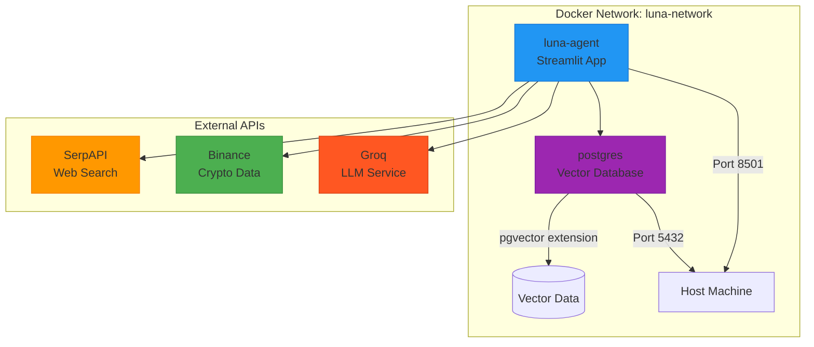

# Luna Agent Preview

A powerful AI agent system that integrates Large Language Models (LLMs) with vector databases and external APIs to provide intelligent, context-aware conversational experiences. Built with LangChain, Streamlit, and PostgreSQL with pgvector extension.

## 🚀 Project Overview

Luna Agent Preview is a prototype AI agent application that demonstrates the integration of modern AI technologies for building intelligent conversational systems. The system combines real-time web search capabilities, semantic vector search, and LLM reasoning to provide comprehensive and contextually relevant responses.

### Key Features

- **🤖 Intelligent Agent System**: LangChain-powered agent with tool selection and reasoning capabilities
- **🔍 Semantic Search**: Vector-based document retrieval using PostgreSQL with pgvector extension
- **🌐 Real-time Information**: Integration with SerpAPI for current web search results
- **💰 Financial Data**: Binance API integration for cryptocurrency market data
- **🎨 Interactive UI**: Streamlit-based web interface for easy interaction
- **🐳 Containerized Deployment**: Docker and Docker Compose for seamless deployment

### Target Users

- **Developers** building AI-powered applications
- **AI Researchers** exploring agent architectures
- **Data Scientists** working with vector databases and embeddings
- **End Users** seeking intelligent conversational interfaces

## 🏗️ Architecture



### System Components

| Component | Technology | Purpose |
|-----------|------------|---------|
| **AI Agent** | LangChain + Groq | Core reasoning and tool orchestration |
| **Web Interface** | Streamlit | User interaction and visualization |
| **Vector Database** | PostgreSQL + pgvector | Semantic search and document storage |
| **Search Engine** | SerpAPI | Real-time web information retrieval |
| **Financial Data** | Binance API | Cryptocurrency market data |
| **Embeddings** | Sentence Transformers | Text vectorization for similarity search |

## 🚀 Quick Start

### Prerequisites

- Docker and Docker Compose installed
- API keys for external services (optional but recommended)

### 1. Clone Repository

```bash
git clone <repository-url>
cd luna-agent-preview
```

### 2. Environment Configuration

Create a `.env` file in the project root:

```bash
# Required API Keys
GROQ_API_KEY=your_groq_api_key_here
SERP_API_KEY=your_serpapi_key_here

# Optional
LANGCHAIN_API_KEY=your_langchain_api_key_here
BINANCE_API_KEY=your_binance_api_key_here
BINANCE_API_SECRET=your_binance_secret_here
```

### 3. Launch Application

```bash
# Start all services
docker-compose up -d

# View logs
docker-compose logs -f

# Stop services
docker-compose down
```

### 4. Access Application

- **Web Interface**: http://localhost:8501
- **Database**: localhost:5432 (user: `executive`, password: `LunaSp@ceX`, database: `pgql`)

## 🛠️ Technology Stack

### Core Technologies

| Technology | Version | Purpose |
|------------|---------|---------|
| **Python** | 3.11+ | Primary programming language |
| **LangChain** | Latest | Agent framework and LLM orchestration |
| **Streamlit** | Latest | Web interface framework |
| **PostgreSQL** | 16 | Primary database with vector support |
| **pgvector** | Latest | Vector similarity search extension |

### Key Dependencies

```bash
# AI & ML
langchain
langchain-groq
langchain-community
sentence-transformers
ollama

# Web Framework
streamlit

# Database
psycopg2-binary

# External APIs
google-search-results
python-binance

# Configuration
python-dotenv
```

## ⚙️ Configuration

### Environment Variables

| Variable | Required | Description | Default |
|----------|----------|-------------|---------|
| `GROQ_API_KEY` | Yes | Groq LLM service API key | - |
| `SERP_API_KEY` | Yes | SerpAPI for web search | - |
| `LANGCHAIN_API_KEY` | No | LangSmith tracing (optional) | - |
| `POSTGRES_HOST` | No | Database host | `postgres` |
| `POSTGRES_PORT` | No | Database port | `5432` |
| `POSTGRES_DB` | No | Database name | `pgql` |
| `POSTGRES_USER` | No | Database user | `executive` |
| `POSTGRES_PASSWORD` | No | Database password | `LunaSp@ceX` |

### Docker Services Configuration

#### luna-agent Service
- **Image**: Built from local Dockerfile
- **Port**: 8501 (Streamlit)
- **Dependencies**: PostgreSQL database
- **Health Check**: Streamlit health endpoint

#### postgres Service
- **Image**: `pgvector/pgvector:pg16`
- **Port**: 5432
- **Extensions**: pgvector for vector operations
- **Initialization**: Automated schema setup via `init.sql`

## 🔧 Development Setup

### Local Development

1. **Install Python 3.11+**
2. **Create Virtual Environment**:
   ```bash
   python -m venv venv
   source venv/bin/activate  # On Windows: venv\Scripts\activate
   ```

3. **Install Dependencies**:
   ```bash
   pip install -r requirements.txt
   ```

4. **Start Database**:
   ```bash
   docker-compose up postgres -d
   ```

5. **Run Application**:
   ```bash
   streamlit run src/app/luna_agent_preview.py
   ```

### Project Structure

```
luna-agent-preview/
├── src/
│   ├── app/
│   │   ├── __init__.py
│   │   ├── luna_agent_preview.py    # Main application
│   │   └── vector_db.py             # Vector database integration
│   └── __init__.py
├── Dockerfile                       # Container definition
├── docker-compose.yaml             # Multi-service orchestration
├── init.sql                        # Database initialization
├── requirements.txt                # Python dependencies
├── README.md                       # This file
└── .env                           # Environment variables (create)
```

### Core Components

#### 1. Agent Architecture (`luna_agent_preview.py`)
- **Agent Initialization**: LangChain agent setup with tool integration
- **Tool Selection Logic**: Dynamic selection of appropriate tools based on user queries
- **Response Generation**: Intelligent response synthesis from multiple data sources

#### 2. Vector Database (`vector_db.py`)
- **Document Storage**: Efficient storage of text documents with embeddings
- **Similarity Search**: Fast vector-based semantic search capabilities
- **Index Management**: Optimized indexing for query performance

#### 3. User Interface
- **Streamlit Dashboard**: Interactive web interface for user interactions
- **Real-time Updates**: Live response streaming and status updates
- **Configuration Management**: Dynamic API key and parameter configuration

## 🔌 API Integration

### SerpAPI (Web Search)
```python
# Configure in environment
SERP_API_KEY=your_serpapi_key_here

# Usage in agent tools
from langchain.tools import Tool
search_tool = Tool(name="web_search", ...)
```

### Groq (LLM Service)
```python
# Configure LLM service
GROQ_API_KEY=your_groq_key_here

# Initialize in agent
from langchain_groq import ChatGroq
llm = ChatGroq(model_name="mixtral-8x7b-32768")
```

### Binance (Financial Data)
```python
# Optional crypto market integration
BINANCE_API_KEY=your_binance_key_here
BINANCE_API_SECRET=your_binance_secret_here
```

## 📊 Monitoring & Debugging

### Application Logs

```bash
# View all service logs
docker-compose logs -f

# View specific service logs
docker-compose logs -f luna-agent
docker-compose logs -f postgres
```

### Database Monitoring

```bash
# Connect to database
docker exec -it luna-postgres psql -U executive -d pgql

# Check vector extension
SELECT * FROM pg_extension WHERE extname = 'vector';

# View documents table
\d+ documents;

# Test similarity search
SELECT similarity_search(array_fill(0.1, ARRAY[1024])::vector);
```

### Health Checks

- **Application Health**: http://localhost:8501/_stcore/health
- **Database Health**: `pg_isready -U executive -d pgql`

### Performance Monitoring

```sql
-- Monitor vector search performance
EXPLAIN ANALYZE SELECT * FROM documents 
ORDER BY embedding <=> $1 LIMIT 10;

-- Check index usage
SELECT schemaname, tablename, indexname, idx_tup_read, idx_tup_fetch 
FROM pg_stat_user_indexes 
WHERE tablename = 'documents';
```

## 🚀 Deployment Options

### Production Deployment

#### Docker Swarm
```bash
# Initialize swarm
docker swarm init

# Deploy stack
docker stack deploy -c docker-compose.yaml luna-stack
```

#### Kubernetes
```yaml
# Example deployment configuration
apiVersion: apps/v1
kind: Deployment
metadata:
  name: luna-agent
spec:
  replicas: 3
  selector:
    matchLabels:
      app: luna-agent
  template:
    metadata:
      labels:
        app: luna-agent
    spec:
      containers:
      - name: luna-agent
        image: luna-agent:latest
        ports:
        - containerPort: 8501
```

#### Cloud Platforms
- **AWS ECS**: Container service with RDS PostgreSQL
- **Google Cloud Run**: Serverless container deployment
- **Azure Container Instances**: Managed container hosting

### Scaling Considerations

- **Horizontal Scaling**: Multiple agent instances behind load balancer
- **Database Scaling**: Read replicas and connection pooling
- **Vector Search Optimization**: Index tuning and query optimization
- **Caching Strategy**: Redis for frequently accessed embeddings

## 🔧 Troubleshooting

### Common Issues

#### 1. Container Build Failures
```bash
# Clear Docker cache
docker system prune -a

# Rebuild without cache
docker-compose build --no-cache
```

#### 2. Database Connection Issues
```bash
# Check database status
docker-compose ps postgres

# Verify network connectivity
docker exec luna-agent-app ping postgres

# Check environment variables
docker exec luna-agent-app env | grep POSTGRES
```

#### 3. Vector Extension Issues
```sql
-- Verify extension installation
SELECT * FROM pg_available_extensions WHERE name = 'vector';

-- Check extension version
SELECT * FROM pg_extension WHERE extname = 'vector';

-- Recreate extension if needed
DROP EXTENSION IF EXISTS vector CASCADE;
CREATE EXTENSION vector;
```

#### 4. API Key Issues
```bash
# Verify environment variables are loaded
docker exec luna-agent-app env | grep API_KEY

# Check API key validity
curl -H "Authorization: Bearer $GROQ_API_KEY" https://api.groq.com/openai/v1/models
```

### Performance Issues

#### Vector Search Optimization
```sql
-- Increase IVFFlat lists for larger datasets
DROP INDEX documents_embedding_cosine_idx;
CREATE INDEX documents_embedding_cosine_idx 
ON documents USING ivfflat (embedding vector_cosine_ops) 
WITH (lists = 1000);  -- Increase for more data

-- Monitor query performance
SET track_io_timing = ON;
```

#### Memory Optimization
```yaml
# docker-compose.yaml memory limits
services:
  luna-agent:
    deploy:
      resources:
        limits:
          memory: 2G
        reservations:
          memory: 1G
```

### Debugging Tools

```bash
# Interactive debugging in container
docker exec -it luna-agent-app python -c "
import sys
sys.path.append('/app')
from src.app.vector_db import VectorDB
db = VectorDB()
print('Database connection successful')
"

# Check Streamlit configuration
docker exec -it luna-agent-app streamlit config show
```

## 🧪 Testing

### Unit Tests
```bash
# Run tests in container
docker exec luna-agent-app python -m pytest tests/

# Run specific test file
docker exec luna-agent-app python -m pytest tests/test_vector_db.py -v
```

### Integration Tests
```bash
# Test database connectivity
docker exec luna-agent-app python -c "
from src.app.vector_db import VectorDB
db = VectorDB()
result = db.similarity_search('test query')
print(f'Test passed: {len(result)} results returned')
"

# Test API endpoints
curl -f http://localhost:8501/_stcore/health
```

### Load Testing
```bash
# Use Apache Bench for basic load testing
ab -n 100 -c 10 http://localhost:8501/

# Monitor resource usage during load
docker stats luna-agent-app luna-postgres
```

## 🤝 Contributing

### Development Guidelines

1. **Code Style**: Follow PEP 8 Python style guidelines
2. **Documentation**: Update docstrings and README for new features
3. **Testing**: Write unit tests for new functionality
4. **Commits**: Use conventional commit messages

### Getting Started

```bash
# Fork repository and clone
git clone https://github.com/your-username/luna-agent-preview.git
cd luna-agent-preview

# Create feature branch
git checkout -b feature/your-feature-name

# Make changes and test
docker-compose up --build

# Submit pull request
git push origin feature/your-feature-name
```

### Code Quality

```bash
# Format code
black src/
isort src/

# Lint code
flake8 src/
pylint src/

# Type checking
mypy src/
```

## 📄 License

This project is licensed under the MIT License - see the [LICENSE](LICENSE) file for details.

## 🆘 Support

- **Documentation**: Check this README and inline code comments
- **Issues**: Report bugs and feature requests via GitHub Issues
- **Discussions**: Join community discussions for questions and ideas
- **Email**: Contact maintainers for urgent support needs

---

**Built with ❤️ by the Luna Agent team**